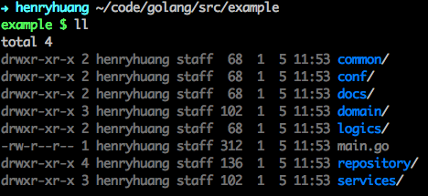

# gorut
it is a tool for managing the go environment and project


```
go get -u github.com/go-rut/gorut
cd $GOPATH/src/github.com/go-rut/gorut
go build
mv gorut /usr/local/bin/
```

------

## GoRut Usage
```
NAME:
   gorut - it is a tool for managing the go environment and project

USAGE:
   gorut [global options] command [command options] [arguments...]

VERSION:
   0.0.1

AUTHOR(S):
   Henry Huang <hhh@rutcode.com>

COMMANDS:
   init		Initial go environment and go source path
   create	Create a new project
   deps		Get dependence of the project
   go		Run command go - link go: ./gorut go [go_subcommand args]
   help, h	Shows a list of commands or help for one command

GLOBAL OPTIONS:
   --help, -h		show help
   --version, -v	print the version
```

## Config Sample

Key|Information|Sample
:-:|:-:|:-:
project|Path: github.com/go-rut; ProjectName: gorut_test|github.com/go-rut/gorut_test
gopath|Go Source Path|/Users/henryhuang/code/example
cgo_enabled| C Go Enabled Flag| true or false
deps| Project Dependences | Support Git or Go


```
{
  "project": "github.com/go-rut/gorut_test",
  "envs": {
    "gopath": "/Users/henryhuang/code/example",
    "cgo_enabled": false
  },
  "deps": [
    {
      "name": "gorut-utils",
      "repo": "https://github.com/go-rut/utils",
      "vcs": "git",
      "options": {
        "flags": [],
        "remote": "origin",
        "branch": "master"
      }
    },
    {
      "name": "gorut-fsm",
      "repo": "github.com/go-rut/fsm",
      "vcs": "go",
      "options": {
        "flags": [
          "-u"
        ]
      }
    }
  ]
}
```

## Step 1 - Initial go environment and go source path

```
gorut init
```

**It will create go source path**

* $gopath/src
* $gopath/pkg
* $gopath/bin


## Step 2 - Create a new project with gorut.config

Key|Information
:-:|:-:
-f|if it is true, it will delete the old project, then create an new project
-t|create the project with template, default is null. buildin: ddd, ddd_sample

### Sample 1

If create an new project like this:

```
gorut create
```

It will create an new project (ProjectPath: $gopath/src/github.com/go-rut/gorut_test) without any code.


### Sample 2

If create an new ddd(Domain Driven Design) project like this:

```
gorut create -f -t=ddd
```

It will create an new project (ProjectPath: $gopath/src/github.com/go-rut/gorut_test) without code.

But it has ddd directories:

* $ProjectPath/conf/
* $ProjectPath/docs/
* $ProjectPath/handlers/
* $ProjectPath/infrastructure/
* $ProjectPath/models/
* $ProjectPath/repository/

### Sample 3

If create an new ddd project like this:

```
gorut create -f -t=ddd_sample
```

It will create project (ProjectPath: $gopath/src/github.com/go-rut/gorut_test) with ddd sample code.



## Step 3 - Move sample config into project path

```
mv gorut.conf /Users/henryhuang/code/example/src/github.com/go-rut/gorut_test
```

## Step 4 - Run ddd sample

* command : gorut go
* Run gorut go - link go: go go_subcommand [args]

```
cd /Users/henryhuang/code/example/src/github.com/go-rut/gorut_test
gorut go run main.go
```


## Dependences

If your project need dependences, you can write into config. It Supported Git And Go.

### Get dependences

```
gorut deps
```

It will get dependences like this:

